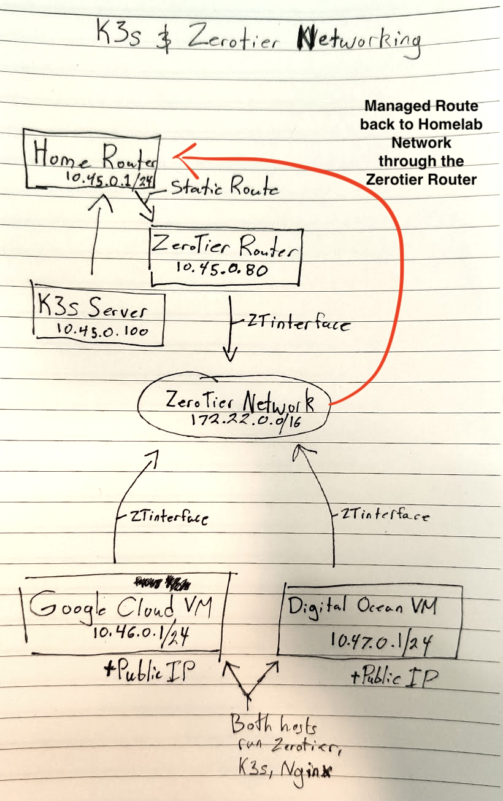
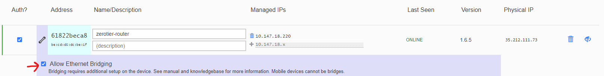

# Zerotier Memory Growth until System Locks Up

This repo should allow anyone to clone it and replicate a ZeroTier memory leak with version 1.6.5 on Google Cloud Ubuntu 20.04 hosts when running K3s. I created an issue on Github ([ZeroTierOne/#1432](https://github.com/zerotier/ZeroTierOne/issues/1423))

<center></center>

## Software Requirements

- Terraform v1.0.0+
- Kubectl
- Zerotier Account
- Zerotier Network
- Google Cloud Account
- Google Cloud CLI Tool (Login with `gcloud auth application-default login`)
- SSH Keypair

## Infrastructure Setup

To try to simulate my homelab, Terraform will provision:

- Two different Subnets in Google Cloud
- Three different compute instances
  - One in Subnet 1
  - Two in Subnet 2

In the `terraform` directory, you'll need to update the `vars.tfvars` file.

When you're ready to set up your infrastructure, run:

```bash
terraform init
terraform apply -var-file=vars.tfvars

# When it's complete, you should get output similar to this:
...
Apply complete! Resources: 9 added, 0 changed, 0 destroyed.

Outputs:

vpc1_compute = {
  "k3s-controlplane" = "35.212.98.22"
  "zerotier-router" = "35.212.111.73"
}
vpc2_compute = {
  "k3s-node" = "35.212.94.125"
}
```

> If you want to get the IPs again later, just run `terraform output` from the terraform directory.

## Create your ZeroTier Network

[In the ZeroTier console](https://my.zerotier.com), create a network and get the Network ID.

## Zerotier Router Provisioning

Provision your Zerotier router with the steps [roughly listed here](https://www.danmanners.com/posts/p2-k3s-digitalocean-zerotier-and-more/#zerotier).

This might look like:

```bash
# Disable the snapd service; this can take up a **TON** of system resources on smaller VMs.
sudo systemctl stop snapd && sudo systemctl disable snapd

# Install Zerotier and join to the previous network
curl -s https://install.zerotier.com | sudo bash
sudo zerotier-cli join 0cccb752f757acbd

# Ensure that we can forward packets between interfaces
sudo sysctl net.ipv4.ip_forward=1
sudo sed -i 's/#net.ipv4.ip_forward=1/net.ipv4.ip_forward=1/g' /etc/sysctl.conf

# Set up iptables rules
ip link | awk -F: '$0 !~ "lo|vir|wl|^[^0-9]"{print $2;getline}'
# eth0        <== This is our physical ethernet
# ztyou2j6dw  <==This is our Zerotier Virtual Adapter
PHY_IFACE="ens4"
ZT_IFACE="$(ip l | grep 'zt' | awk '{print substr($2,1,length($2)-1)}')" # <== This command will grab your ZeroTier interface name
sudo iptables -t nat -A POSTROUTING -o $PHY_IFACE -j MASQUERADE
# Create the rules going one way
sudo iptables -A FORWARD -i $PHY_IFACE -o $ZT_IFACE -m state --state RELATED,ESTABLISHED -j ACCEPT
sudo iptables -A FORWARD -i $ZT_IFACE -o $PHY_IFACE -j ACCEPT
# Then flip it and create the rules going the opposite direction
sudo iptables -A FORWARD -i $ZT_IFACE -o  -m state --state RELATED,ESTABLISHED -j ACCEPT
sudo iptables -A FORWARD -i $PHY_IFACE -o $ZT_IFACE -j ACCEPT

# Make sure the rules are persistent after reboot/poweroff
sudo apt install iptables-persistent -y
sudo bash -c iptables-save | sudo tee /etc/iptables/rules.v4

# Ensure that Zerotier always comes back up after a reboot
sudo systemctl enable --now zerotier-one
```

Back on the ZeroTier Network, you'll want to add a Managed Route with the destination of `192.168.0.0/24` via the IP of your ZeroTier Router IP address (the zerotier IP, not the host IP).

Also, make sure you enable bridging in the Zerotier console.



## All K3s Hosts

```bash
# Disable the snapd service; this can take up a **TON** of system resources on smaller VMs.
sudo systemctl stop snapd && sudo systemctl disable snapd

# Install K3s
sudo wget https://github.com/k3s-io/k3s/releases/download/v1.21.2%2Bk3s1/k3s -O /usr/local/bin/k3s
sudo chmod a+x /usr/local/bin/k3s
sudo mkdir -p /etc/rancher/k3s
```

## K3s Control Plane

On your `k3s-controlplane` vm, you can set up a static route to be able to reach the `k3s-node` host by running:

```bash
sudo ip route add 192.168.0.2 dev ens4                                # This **should** be the right IP and ethernet interface, but validate if having issues.
sudo ip route add $ZeroTierSubnet/$ZeroTierSubnetMask via 192.168.0.2 # This **should** be the right IP for `via`, but validate if having issues.
sudo ip route add 192.168.1.0/24 via 192.168.0.2                      # This **should** be the right IP for `via`, but validate if having issues.
```

Additionally:

- Fill in the values in the `config.yaml` file appropriately.
- Copy it to `/etc/rancher/k3s/config.yaml`
- Copy the service file to `/etc/systemd/system/k3s.service`
- Run `sudo systemctl daemon-reload && sudo systemctl enable --now k3s`
- Run `cat /var/lib/rancher/k3s/server/token`; you'll need this for the worker node.

Then, let's add a couple services:

```bash
sudo wget "https://dl.k8s.io/release/$(curl -L -s https://dl.k8s.io/release/stable.txt)/bin/linux/amd64/kubectl" -O /usr/local/bin/kubectl
sudo chmod a+x /usr/local/bin/kubectl
sudo KUBECONFIG=/etc/rancher/k3s/k3s.yaml kubectl create namespace argocd
sudo KUBECONFIG=/etc/rancher/k3s/k3s.yaml kubectl apply -n argocd -f https://raw.githubusercontent.com/argoproj/argo-cd/stable/manifests/install.yaml

```

You also may want to copy off the kubeconfig file from the control plane. It will be located, by default, at `/etc/rancher/k3s/k3s.yaml`. SCP it locally to your system and put it at `~/.kube/config` with `0600` permissions.

## K3s Worker Node

On your `k3s-node` vm:

```bash
curl -s https://install.zerotier.com | sudo bash
sudo zerotier-cli join 0cccb752f757acbd

# Verify that you can ping the control plane node
```

Additionally:

- Fill in the values in the `config.yaml` file
- Copy it to `/etc/rancher/k3s/config.yaml`
- Copy the service file to `/etc/systemd/system/k3s-node.service`
- Run `sudo systemctl daemon-reload && sudo systemctl enable --now k3s-node`

## Destorying Infrastructure

When you're done, destroy your Terraform infrastructure by running the following command from the `terraform` directory:

```bash
terraform destroy -var-file=vars.tfvars
```
